# IT System Context Diagrams

## Overview

This package demonstrates how to generate clear, maintainable **IT System Context Diagrams** using the Relationship Visualizer and a set of SQL‑driven queries. It provides a fast, Excel‑based way to visualize system boundaries, key actors, applications, data stores, and the relationships that connect them.

|  |
| :------------------------: |

> [!IMPORTANT]
> This approach is **not** intended to replace dedicated Enterprise Architecture platforms (e.g., Sparx Enterprise Architect, LeanIX, Orbus Infinity, Bizzdesign Horizzon, Avolution ABACUS, MEGA HOPEX).  
>
> Those tools provide enterprise‑scale capabilities—governance, repositories, impact analysis, ArchiMate/TOGAF alignment, access controls, and traceability—that go far beyond spreadsheet‑based modeling.
>
> This example is designed for scenarios where:
> - Budget or scale makes a full EA suite impractical  
> - Teams need rapid prototyping, ideation, or quick relationship views  
> - Speed and low overhead matter more than formal governance  

This tool is ideal for fast iteration in Excel, on‑the‑fly visualization, early‑stage architecture discussions, and lightweight exploration of system boundaries—whether used standalone or as a complement to a formal EA repository.

## Background & Inspiration

Context diagrams have long been used in systems engineering and software architecture to clarify system boundaries and external interactions. This example builds on that tradition and draws inspiration from modern approaches such as the [C4 model’s System Context diagram](https://c4model.com/).

While influenced by C4, this implementation is tailored for enterprise IT environments. It extends the classic context diagram by incorporating application types, data stores, integration details, relationship quality indicators, and optional grouping for business or technical domains.

The result is a fast, Excel‑driven way to produce self‑documenting diagrams that help architects, security teams, and stakeholders communicate complex IT landscapes without requiring a full enterprise architecture platform.

---

## Data Model Overview

### Reference Worksheets

Reference worksheets do not create nodes or edges directly. Instead, they provide authoritative descriptions or data‑validation values used throughout the workbook.

- **Application Descriptions** — Defines the authoritative master list of **all** applications within the enterprise. Populating this list is typically a one‑time exercise using exports from an EA system or another trusted source.

  | 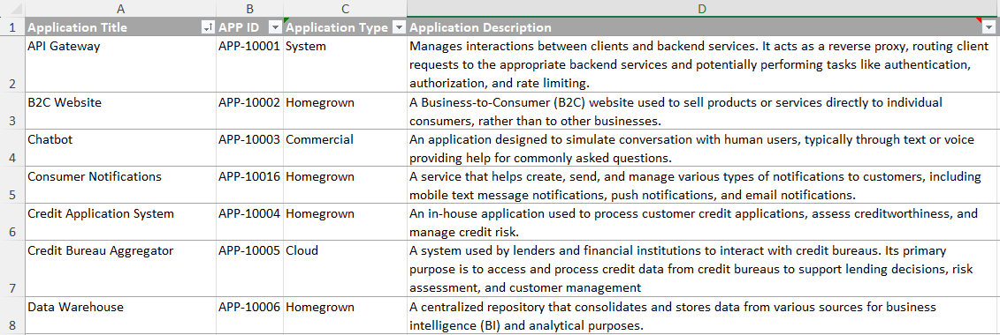 |
  | :---------------------------------------: |

  Each application must have a unique Application Title, Identification Number, Description, and be classified as one of the following types:

  -  — Cloud
  -  — Commercial
  -  — Homegrown
  -  — Open‑source
  -  — Partner
  -  — System

### Node‑related Worksheets

Nodes are created from the following worksheets:

- **Actors** — Defines the people, systems, or automated elements that initiate or receive interactions.

  | 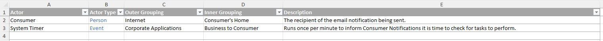 |
  | :--------------------: |

  The *Actor Type* values (shown in blue) are selected from:

  -  — Alarm
  -  — Bot
  -  — Event
  -  — Organization
  -  — Person
  -  — Process

  Optional **Outer** and **Inner Grouping** values allow you to cluster Actor nodes. These values are free‑text.

- **Data Stores** — Defines where data is obtained from or saved to.

  | 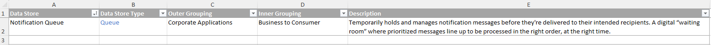 |
  | :------------------------: |

  List all data stores in scope for the context diagram, provide descriptions, and classify each data store as one of:

  -  — Database
  -  — Directory
  -  — File
  -  — Folder
  -  — Queue
  -  — Repository

- **Applications** — Select the specific applications that appear in this diagram.

  | 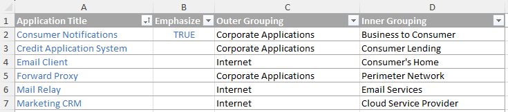 |
  | :---------------------------: |

  Choose entries from the master **Application Descriptions** list. Optional **Outer** and **Inner Grouping** values allow you to cluster application nodes. These values are free‑text.

- **Notes** — Creates general annotations or floating text boxes.

  | 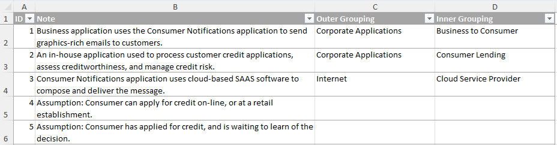 |
  | :--------------------: |

  Optional **Outer** and **Inner Grouping** values allow you to cluster notes. These values are free‑text.

### Edge‑related Worksheets

Edges are defined in these worksheets. Each row creates one directed relationship with an optional caption. Text in blue is selected from drop‑down lists; text in black is free‑text.

- **Actor to Application** — Defines actions between an Actor and an Application, with optional captions.

  | 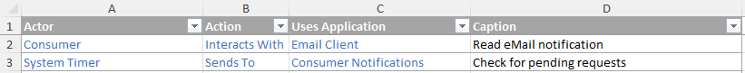 |
  | :-----------------------------------: |

- **Application to Application** — Defines connections from one application to another, including the method and protocol of the exchange.

  | 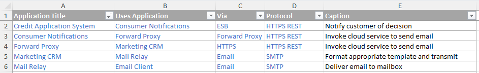 |
  | :-----------------------------------------: |

- **Application to Data Store** — Defines connections from an application to a data store, including the action (e.g., *Sends To*, *Gets From*), the method (e.g., *Enqueue*, *Dequeue*), and an optional caption.

  | 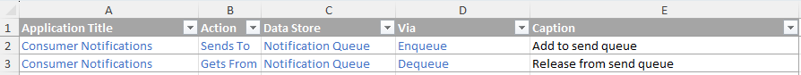 |
  | :----------------------------------------: |

### Support Worksheets

- **Lists** — Contains named‑range lists used to populate context‑sensitive dropdowns on the data‑entry worksheets.

  Some entries in a blue range have refinement values in an orange range. For example, under **Via**, the entry *Email* has refinement values *Exchange* and *SMTP*. These values have corresponding styles defined on the `styles` worksheet.

  | 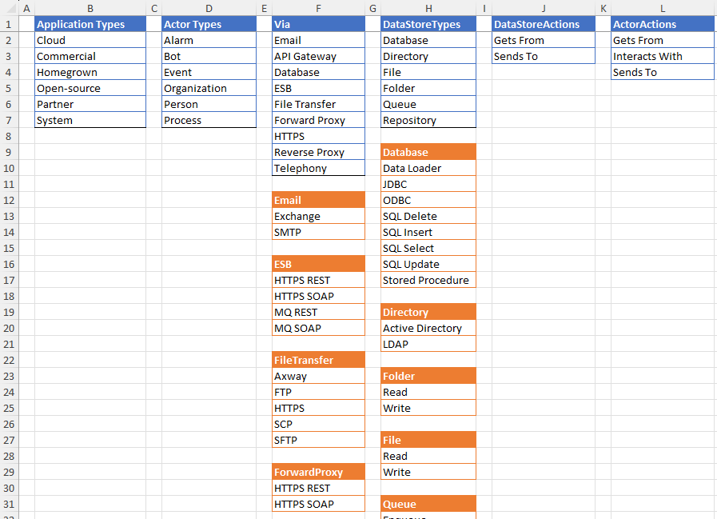 |
  | :--------------------: |

> [!WARNING]
> If you add values to these lists, you must also create corresponding style definitions on the `styles` worksheet that follow the naming conventions.

- **Options** — Provides additional controls for what elements are included in the context diagram.

  | 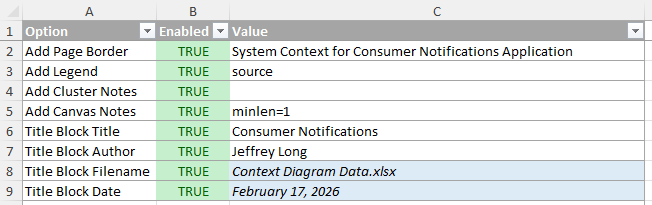 |
  | :-----------------------: |

  The **Options** worksheet is organized as follows:
  - **Option** — The parameter name, referenced in SQL to determine whether the option is enabled.
  - **Enabled** — True/false switches that toggle options on or off.
  - **Value** — Values such as the diagram name or author name.

    Cells shaded in light blue contain Excel formulas (e.g., file name, current date).

---

## Grouping & Layout

A simple grouping mechanism is provided to let you place Actors, Applications, Data Stores, and Notes into clustered rectangles that represent logical or physical domains.

- Supports **up to two levels** of clustering (Outer Grouping + Inner Grouping) for defining boundaries such as “Finance Dept → Core Banking” or “Cloud → AWS Prod.”
- Actors, Applications, Data Stores, and Notes are combined using SQL `UNION` queries so that nodes sharing the same outer or inner grouping values are placed together in the same cluster.

---

## Styling & Legend

The tool applies consistent, meaningful visual styles to improve clarity and quick comprehension.

### Node Styling

**Unique colors and small icons** are automatically assigned based on node type:

- **Actors** — Rounded‑square shapes with a pastel fill and an icon based on Actor type
  
  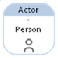

- **Applications** — Square shapes with a deep, distinct color and an icon based on Application type
  
  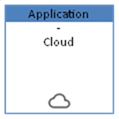

- **Data Stores** — Icons vary by Data Store type
  
  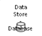 

- **Notes** — Light yellow sticky‑note style.
  
  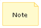

### Edge Styling

- **Approved / Favored relationships** — Solid **green** lines indicating recommended, secure, or modern integration paths.
  
  

- **Discouraged relationships** — Dashed or dotted **yellow** lines highlighting legacy, risky, insecure, or deprecated integrations (e.g., using a forward proxy instead of the preferred API gateway).
  
  

- **Disapproved / Forbidden relationships** — **Red** lines indicating prohibited, insecure, or unacceptable integrations (e.g., unencrypted file transfer).
  
  

- Additional labels (protocol, access method, captions) appear as head/tail labels or inline edge text for added context.

### Group Styling

Three cluster styles are available when building context diagrams:

- **Page Border** — A thick gray border with rounded corners surrounding the entire diagram. The page border can be disabled via the Options worksheet.
  
  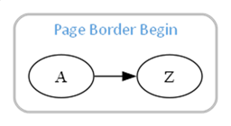

- **Outer Grouping** — Nodes sharing an Outer Grouping value are placed in a rounded‑corner cluster with a light gray background.
  
  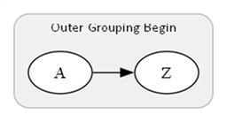

- **Inner Grouping** — Nodes sharing an Inner Grouping value are placed in a rounded‑corner cluster with a white background.
  
  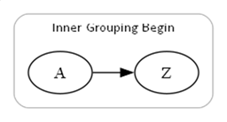

### Auto‑Generated Legend

When the diagram is rendered, the tool can automatically generate a compact **legend table** that shows the diagram title; the colors and icons for Actors, Applications, and Data Stores; the name of the workbook used to create the diagram; the author; and the date the data was saved (not the date the diagram was generated).

For example:

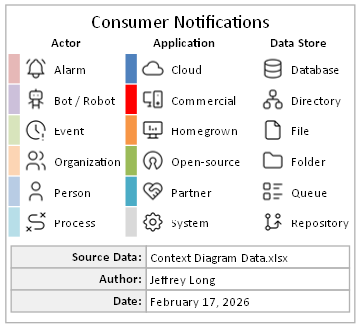

This legend ensures the diagram is self‑documenting—no need to explain colors or icons separately when sharing or presenting.

---

## Who This Example Is For

This example is designed for architects, analysts, and solution designers who want to produce clear, consistent context diagrams without needing to understand or modify the underlying SQL. The focus is on using the structured worksheets and letting the Relationship Visualizer handle the rendering.

## What This Example Demonstrates

This example shows how a small set of structured worksheets—Actors, Applications, Data Stores, Notes, and their connecting relationships—can be combined with the Relationship Visualizer to produce a clear, self‑documenting context diagram. It illustrates the full workflow: defining the data, selecting what’s in scope, adding the interactions, and generating a styled, presentation‑ready diagram with a single SQL run.

### How the Pieces Fit Together

At a high level, the example follows a simple flow:

**Worksheets → SQL Worksheet → Graphviz → Rendered Diagram**

You enter structured data in the worksheets, the SQL reads and combines that data, and the Relationship Visualizer uses Graphviz to produce a clean, styled context diagram.

### What You Can Customize

This example is intentionally flexible. You can tailor it to your needs by modifying:

- Actors, Applications, Data Stores, and Notes
- Outer and Inner Grouping values to reorganize the layout
- Relationships in the edge worksheets
- Diagram metadata such as title, author, and page border options

These adjustments let you adapt the example to reflect your own enterprise environment without changing the underlying SQL.

### What Not to Change

You do not need to understand or modify the SQL to use this example. The SQL is already complete and simply reads the worksheets to generate the diagram. Avoid changing it unless you intend to extend the model, as modifications may cause the diagram to render incorrectly or fail to generate.

With the boundaries and customization options in mind, you’re ready to walk through the example.

## How to Use This Example

With that structure in mind, you can walk through the example in just a few steps:

1. Open the Excel **data** file.
2. Review or populate the master lists (Actors, Application Descriptions, Data Stores).
3. Select the Applications that are in scope for this diagram.
4. Add the required connections in the edge worksheets.
5. Open the Excel **Relationship Visualizer** tool.
6. Navigate to the **SQL** worksheet.
7. Press **Run SQL Commands** to execute the queries and instantly render the context diagram.

## Adapting the Example

This example is intended as a starting point. You can use it as‑is to generate a complete context diagram, or adapt the structure to reflect your own enterprise environment and modeling standards.

Feel free to adapt this structure for your own enterprise views.

## Credits & Attributions

This example uses icons from **Tabler Icons**, available under the MIT License.  

See the [images/README.md](./images/README.md) file in this directory for full attribution and license details.