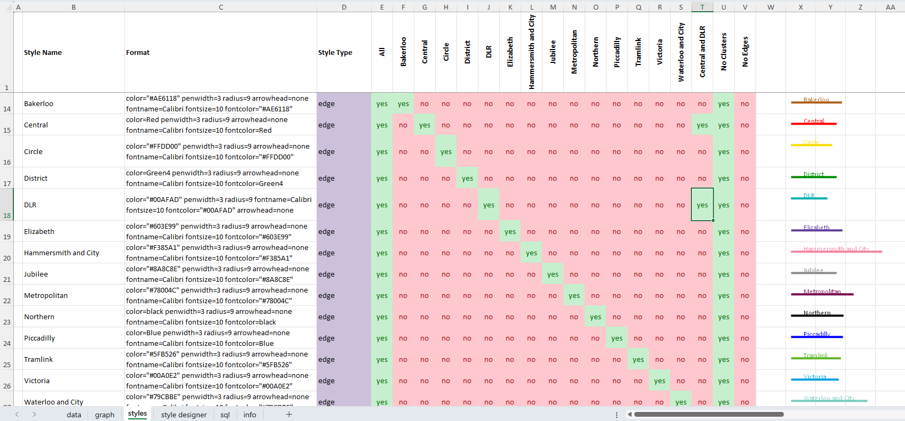
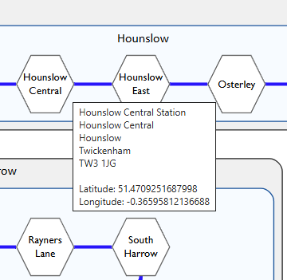

# London Underground

## Overview

This package demonstrates how to generate the complete subway map for the **London Underground** using the Relationship Visualizer with SQL-driven queries, and filter the results to view each line independently.

|  |
| :-----------------------------------------------: |

*Graph view of the Metropolitan Line*

The included workbook, `London Underground Data.xlsx`, provides a curated dataset of tube station information, station-to-station connections, and descriptive metadata suitable for subway map visualization.

The SQL statements transform these flat records into logical subway maps, showing each tube line in the color assigned by Transport for London, with node styling to depict stations and interchanges. The example also demonstrates how to generate **informative tooltips** for stations, interchanges, lines, and postal regions. These tooltips appear when the graph is **published as SVG**, and they surface key details directly in the map, making it easier to explore the network and understand the structure of each line.

The sample includes a large number of records to demonstrate that the Relationship Visualizer can handle substantial datasets without difficulty.

## Quick Start

To generate a London Underground map:

1. Open the **Relationship Visualizer** workbook.  
2. Navigate to the **SQL** worksheet.  
3. Ensure the **DATA FILE** points to `London Underground Data.xlsx`.  
4. Click **Run SQL Commands**.  
5. The subway graph will appear on the **graph** worksheet.  
6. Use the **Graphviz ribbon tab** to adjust layout, spacing, and visual settings.

> [!TIP]
> Tooltips for stations, interchanges, lines, and postal regions appear only when the graph is published as **SVG**. Set the file extension to **svg** before pressing the **Publish** button on the Graphviz ribbon tab to view the interactive tooltips.

This is the fastest way to explore the dataset.

## Views

This spreadsheet demonstrates how to use **Views** to filter data when constructing graphs. Instead of maintaining separate SQL queries for each Tube line, you can define Views that let you display all lines, a single line, or any combination of lines.

Views are created on the `styles` worksheet. Each View is represented by a column containing `yes` or `no` values that tell Relationship Visualizer whether to include or exclude elements associated with that style during graph rendering.

An example of the London Underground Views appears below:

|  |
| :--------------: |

Each time you add a column to the `styles` worksheet, the Views dropdown on the Graphviz tab updates automatically. Select a View from the dropdown and refresh the graph to see the corresponding filtered perspective.

## Tooltip Design

The London Underground example shows how to include informative tooltips that make graphs easier to explore. 

|  |
| :----------------: |

*Example tooltip for the Hounslow Central station*

In this example each tooltip surfaces key details directly in the SVG output:

- **Stations** and **Interchanges** show name, neighborhood, postal area, postal code, latitude and longitude.  
- **Lines** display the "from station" and "to station"
- **Clusters** Show the geographic region used for grouping.

Tooltips appear only when the graph is published as **SVG**. Set the file extension to `svg` before pressing the **Publish** button on the Graphviz ribbon tab to view the interactive tooltips.

> [!NOTE]
> **Why tooltips matter:** Large network diagrams can be visually dense, especially when many lines and stations overlap. Tooltips provide a lightweight way to surface key details without cluttering the map. They let you explore stations, interchanges, lines, and postal regions directly in the SVG, giving you context on demand while keeping the diagram clean and readable.

## Data Used

This dataset for the **Relationship Visualizer** tool models the London Underground ("the Tube") network, focusing on lines, stations, and their interconnections. The Excel spreadsheet was compiled from the following authoritative and detailed sources.

### Tube Line Information

The iconic London Tube map is one of the most famous diagrams in the world, originally designed by Harry Beck in 1933.

- **Transport for London (TfL)** publishes the official [Standard Tube Map](https://content.tfl.gov.uk/standard-tube-map.pdf) (PDF, updated regularly).  
- **Transport for London** provides an interactive directory of [Stations, Stops and Piers](https://tfl.gov.uk/travel-information/stations-stops-and-piers/).  
- **dannycox.me.uk** offers a useful [Stations by Line](https://tubephotos.dannycox.me.uk/stationsbyline.html) listing.  
- **Mapping London** features an informative article on the [history and design of the TfL Tube Map](https://mappinglondon.co.uk/2015/the-tube-map/).

### Station Information

The London Underground comprises **11 lines** serving **272 stations**. Stations include details such as lines served, fare zones, opening dates, former names, and passenger usage.

Key sources used:

- **Wikipedia** maintains a comprehensive [List of London Underground stations](https://en.wikipedia.org/wiki/List_of_London_Underground_stations), including lines served, fare zones, opening dates, former names, and annual passenger usage.  
- **dannycox.me.uk** documents [every station on the London Underground and Docklands Light Railway](https://tubephotos.dannycox.me.uk/alphabeticalStationList.html) (alphabetical list with photos and links).  
- **doogal.co.uk** provides a clean [list of London stations](https://www.doogal.co.uk/london_stations) with additional context.  
- **doogal.co.uk** also offers [UK postcodes data including latitude and longitude](https://www.doogal.co.uk/UKPostcodes), used for geocoding station locations where needed.

For the most up-to-date official information, always cross-check with TfL directly.

## Summary

The London Underground example brings together SQL-driven modeling, style-based Views, and SVG tooltips to produce a clear and navigable map of a large real-world network. It shows how the Relationship Visualizer can organize complex data, highlight structure through shape, color and clustering, and surface details on demand without overwhelming the diagram. This example provides a practical foundation for building your own network visualizations with similar patterns and techniques.