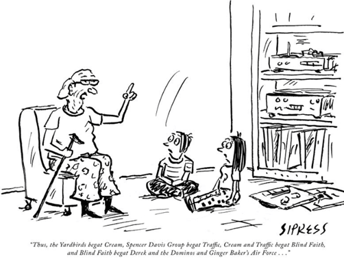
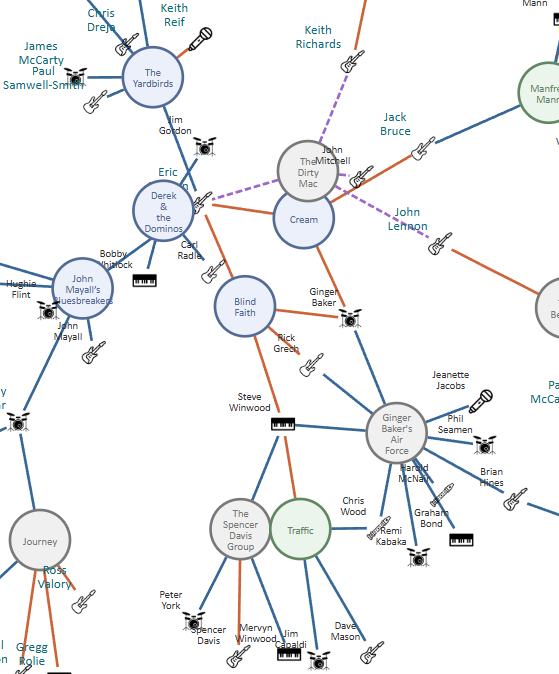

# Musician to Band Connections

These kids could really use a graph to follow what their grandfather is explaining:

|  |
| :------------------------------: |
| *"Thus, the Yardbirds begat Cream, Spencer Davis Group begat Traffic, Cream and Traffic begat Blind Faith, and Blind Faith begat Derek and the Dominos and Ginger Baker's Air Force..."*   Cartoonist: David Sipress - Publication: The New Yorker - Date: August 7, 2017  |
|  |
| **The Relationship Visualizer can handle that!**    |

## Overview
This package demonstrates how to graph connections between musicians and rock bands using the Relationship Visualizer with SQL‑driven queries. The included workbook, `musicians.xlsx`, provides a representative dataset suitable for large-scale force-directed modeling and visualization.

The example SQL statements show how to transform random flat records into connected  relationships that the Relationship Visualizer can render as a graph.

|  |
| ----------------------------------- |

This sample contains **test data only** sourced from [BandToBand.com](bandtoband.com). 

## Quick Start

If you want to generate an organization chart immediately, follow these steps:

1. Open the **Relationship Visualizer** workbook.  
2. Go to the **SQL** worksheet.  
3. Click **Run SQL Commands**.  
4. After a few seconds, the org chart will appear on the **graph** worksheet.  
5. Use the **Graphviz ribbon tab** to adjust layout, arrowheads, zoom, and other visual settings.

## Data Dictionary — musicians.xlsx

The `musicians.xlsx` workbook contains four related tables used to model musicians, bands, genres, and their relationships. The structure is designed for use with the Relationship Visualizer and supports SQL‑driven graph modeling.

               +----------------------+
               |      musician        |
               +----------------------+
               | Musician (PK)        |
               | AKA                  |
               | BirthYear            |
               | DeathYear            |
               | YearsActive          |
               | PrimaryInstrument    |
               | Role                 |
               | Country              |
               | InRnRHallOfFame      |
               | InRnRHallOfFameWith  |
               +----------+-----------+
                          |
                          | 1-to-many
                          |
               +----------v-----------+
               |   musician-to-band   |
               +----------------------+
               | Musician (FK)        |
               | Band (FK)            |
               | Relationship         |
               +----------+-----------+
                          |
                          | many-to-1
                          |
               +----------v-----------+
               |        band          |
               +----------------------+
               | Band (PK)            |
               | Genre (FK)           |
               | Description          |
               | Origin               |
               | Years Active         |
               | Decade               |
               | Era                  |
               | Year From            |
               | Year To              |
               | Band Type            |
               | Notable Members      |
               | Signature Work       |
               | Notes                |
               +----------+-----------+
                          |
                          | many-to-1
                          |
               +----------v-----------+
               |        genre         |
               +----------------------+
               | Genre (PK)           |
               | Definition           |
               +----------------------+

---

### Worksheet: `musician`

| Column | Definition |
|--------|------------|
| **Musician** | The musician’s primary name. Used as the unique identifier across worksheets. |
| **AKA** | Alternate names, stage names, or common aliases. May contain multiple values separated by commas. |
| **BirthYear** | Year the musician was born (YYYY). Unknown values may be blank. |
| **DeathYear** | Year the musician died (YYYY). Blank if still living or unknown. |
| **YearsActive** | A textual range describing the musician’s active career span (e.g., “1965–present”). |
| **PrimaryInstrument** | The musician’s main instrument (e.g., Guitar, Bass, Drums, Vocals). |
| **Role** | The musician’s primary role in a band or musical context (e.g., Vocalist, Guitarist, Drummer, Songwriter). |
| **Country** | Country of origin or nationality. |
| **InRnRHallOfFame** | Indicates whether the musician is individually inducted into the Rock & Roll Hall of Fame (`Yes` / `No`). |
| **InRnRHallOfFameWith** | If inducted as part of a band, lists the band name(s). Blank if not applicable. |

---

### Worksheet: `musician-to-band`

This table models the many‑to‑many relationship between musicians and bands.

| Column | Definition |
|--------|------------|
| **Musician** | Name of the musician (foreign key to `musician.Musician`). |
| **Band** | Name of the band (foreign key to `band.Band`). |
| **Relationship** | Describes the musician’s association with the band (e.g., “Member,” “Founding Member,” “Touring Musician,” “Session Musician”). |

---

### Worksheet: `band`

| Column | Definition |
|--------|------------|
| **Band** | The band’s name. Serves as the unique identifier for band‑related relationships. |
| **Genre** | Primary musical genre associated with the band (e.g., Rock, Metal, Punk). |
| **Description** | Short narrative description of the band (history, style, significance). |
| **Origin** | City, state, or country where the band was formed. |
| **Years Active** | Textual range describing the band’s active years (e.g., “1970–1995”). |
| **Decade** | The decade most associated with the band’s peak activity (e.g., 1970s, 1980s). |
| **Era** | A broader classification grouping bands into eras (e.g., Heavy Metal, New Wave). |
| **Year From** | Numeric year the band began (YYYY). |
| **Year To** | Numeric year the band ended or disbanded (YYYY). Blank if still active. |
| **Band Type** | Category describing the band’s structure (e.g., Duo, Trio, Quartet, Large Ensemble). |
| **Notable Members** | Key members of the band, typically the most recognized lineup. |
| **Signature Work** | The band’s most iconic album or song. |
| **Notes** | Additional context, trivia, or modeling notes. |

---

### Worksheet: `genre`

| Column | Definition |
|--------|------------|
| **Genre** | Name of the musical genre. |
| **Definition** | Short description of the genre’s characteristics, influences, or typical sound. |

## SQL Queries for Relationship Visualizer

The Relationship Visualizer supports SQL queries that can distill distinct lists of values and return **From / To** relationships.

This musician to band demonstration uses the following techniques:

- Standard SQL queries to create nodes and edges 
- HTML-like labels to create a color legend
- Meaningful tooltips for graphs rendered as SVG
- SQL `IIF` conditional logics 
- Data-driven node and edge style names
- Image-based nodes

## How the SQL Builds the Musician to Band Chart

The SQL behind this example follows a clear, staged process that mirrors how the Relationship Visualizer assembles the final diagram. It begins by creating a legend node, then builds the connections between bands and musicians, followed by generating the musician and band nodes themselves. Finally, it applies additional styling for Rock & Roll Hall of Fame inductees. Each step contributes a distinct layer of structure or presentation, resulting in a chart that reflects both the data relationships and the visual conventions defined in the workbook.

The Relationship Visualizer constructs the chart using this five‑step process:

    Selected Musician
            │
            ▼
    [Step 1] Create a legend node using static SQL that emits an HTML‑like label.
            │
            ▼
    [Step 2] Create the edges between Bands and Musicians
            │
            ├── Build relationships from Band to Musician
            └── Use relationship details to style each edge
            ▼
    [Step 3] Create the Musician Nodes
            │
            ├── Use SELECT DISTINCT to eliminate duplicate Musician entries
            ├── Assign the musician’s instrument as the node style name
            └── Use IIF() to customize tooltips and node labels
            ▼
    [Step 4] Create the Band Nodes
            │
            ├── Use SELECT DISTINCT to eliminate duplicate Band entries
            └── Assign the band’s genre as the node style name
            ▼
    [Step 5] Embellish styling for Rock & Roll Hall of Fame musicians
            │
            ├── Identify musicians where InRnRHallOfFame = YES
            └── Emit a second node definition and let Graphviz merge the styles
            ▼
    Final Graph (Preview / Publish)

Together, these steps produce a chart that reflects both the structural relationships in the data and the visual conventions defined in the workbook. The result is a musician‑to‑band diagram that is easy to read, stylistically consistent, and fully driven by the underlying SQL.